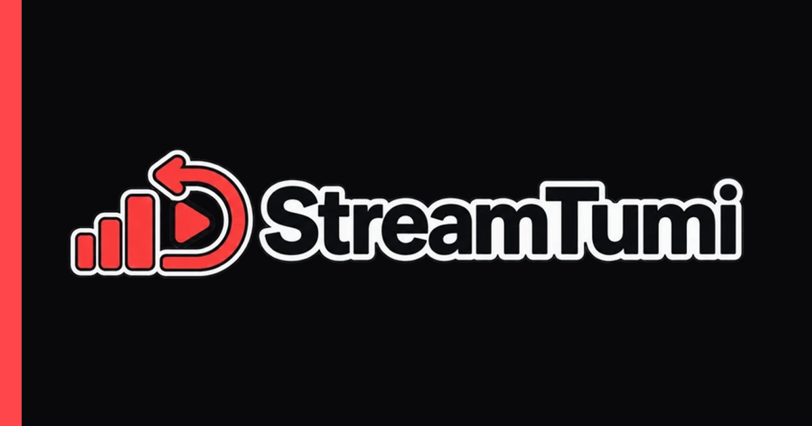

# StreamTumi

StreamTumi is a free, self-hosted platform for creating synchronized online TV
and radio stations. Operators upload or import media, arrange programming, and
share browser, mobile, or Roku playback from infrastructure they control.



## What is included

- Local password authentication and host-local administrator recovery.
- Uploaded TV programming, synchronized playlists, and optional channel HLS.
- Uploaded radio tracks, weekly clocks, static HLS, and local playout.
- Private links, passwords, rooms, moderation, chat, and a public guide.
- Optional YouTube imports through a pinned yt-dlp release.
- Optional WeatherStar 4000+ channels built from vendored MIT-licensed source.
- Locally built Expo mobile and Roku clients.
- CPU-first Docker Compose deployment with optional NVIDIA acceleration.

StreamTumi does not require a hosted StreamTumi service, analytics account, or
cloud build account. Runtime services and durable data remain under the
operator's control.

## Requirements

- A 64-bit Linux host with Docker Engine and Docker Compose v2.
- At least one hostname and HTTPS for public deployments.
- Enough CPU, memory, and disk for the media workload.
- Outbound Internet access during builds and updates.
- Optional public weather-data access for WeatherStar.
- Optional YouTube access when imports are enabled.

Start with one transcode worker and low optional-worker concurrency. Media
processing and weather rendering can consume substantial CPU, memory, and
temporary disk.

## Local quick start

Copy and protect the environment template:

```sh
cp .env.example .env
chmod 600 .env
```

Generate independent secrets:

```sh
openssl rand -base64 48
openssl rand -base64 36
openssl rand -base64 36
```

Put those values in `APP_SECRET`, `POSTGRES_PASSWORD`, and
`MINIO_ROOT_PASSWORD`. For loopback-only evaluation, also set:

```dotenv
APP_URL=http://localhost:3000
APP_DOMAIN=localhost
ALLOW_INSECURE_HTTP=true
```

Start the CPU-first core:

```sh
docker compose up -d --build
docker compose ps
```

Create the first administrator without enabling public registration:

```sh
docker compose exec app npm run admin:bootstrap -- \
  --email admin@example.com \
  --display-name "StreamTumi Administrator"
```

The command prints a random temporary password once. Sign in at
`http://localhost:3000` and replace it immediately.

## Production

Set `APP_URL` to the canonical HTTPS origin, set `APP_DOMAIN` to its hostname,
leave `ALLOW_INSECURE_HTTP=false`, and start the reverse proxy profile:

```sh
docker compose --profile proxy up -d --build
```

Only Caddy ports 80 and 443 should be public. PostgreSQL, Valkey, MinIO, the
application port, and workers should remain private or loopback-only.

Read [`docs/self-hosting.md`](docs/self-hosting.md),
[`docs/backup-restore.md`](docs/backup-restore.md), and
[`docs/upgrading.md`](docs/upgrading.md) before operating real data.

## Optional profiles

```sh
# Canonical media processing
docker compose --profile media up -d

# Local radio preparation and playout
docker compose --profile radio up -d

# TV channel-HLS preparation and playout
docker compose --profile tv up -d

# Vendored WeatherStar and weather renderer
docker compose --profile weather up -d --build

# NVIDIA acceleration for the main transcode worker
docker compose -f compose.yaml -f compose.gpu.yaml up -d
```

To provision the shared weather station after the weather profile is healthy:

```sh
docker compose exec app npm run weather:provision -- \
  --owner-email admin@example.com
```

WeatherStar is informational, US-focused, and must not be used for life-safety
decisions. See [`docs/weather-channel.md`](docs/weather-channel.md).

YouTube importing is disabled by default. Enabling it does not grant rights to
download or rebroadcast content; see
[`docs/external-access.md`](docs/external-access.md).

## Clients

- Mobile source and local-build instructions: [`apps/mobile`](apps/mobile)
- Roku source and packaging instructions: [`docs/mobile-release.md`](docs/mobile-release.md)

The Roku manifest uses the reserved `https://streamtumi.invalid` origin. Replace
`api_origin` with the self-hosted HTTPS origin before packaging.

## Development

```sh
npm ci
npm run lint
npm run typecheck
npm test
npm run build
```

The shared contracts and mobile client have independent lockfiles and checks:

```sh
npm --prefix packages/contracts ci
npm --prefix packages/contracts test
npm --prefix apps/mobile ci
npm --prefix apps/mobile run check
```

WeatherStar source is pinned under `third_party/ws4kp`; update it only through
the documented review process in `docs/third-party-updates.md`.

## Security

Report vulnerabilities through GitHub private vulnerability reporting rather
than a public issue. See [`SECURITY.md`](SECURITY.md).

Never commit `.env`, database dumps, media backups, TLS private keys, mobile
signing material, or Roku device passwords.

## License

StreamTumi application code is available under the [MIT License](LICENSE).
Third-party components remain under their own licenses; see
[`THIRD_PARTY_NOTICES.md`](THIRD_PARTY_NOTICES.md).

The StreamTumi name and logos are reserved marks and are not granted by the MIT
License. See [`TRADEMARKS.md`](TRADEMARKS.md).
